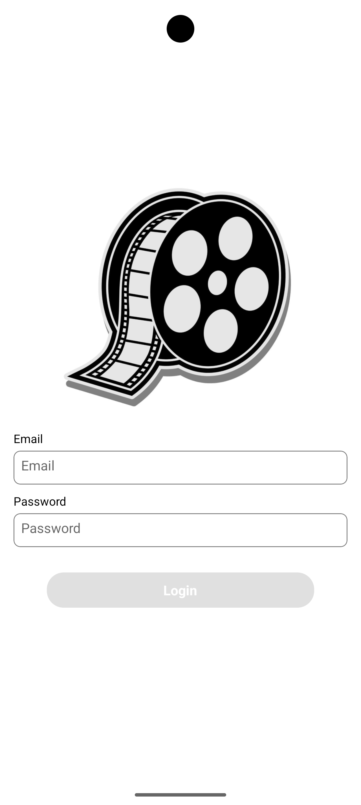
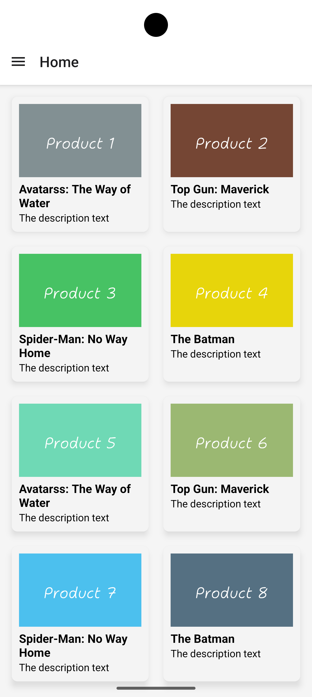

# Assignment App

This is a sample React Native app with Login and Home page.

## Features

- Login
- Dashboard with movies list
- Multilingual (i18n)
- Logout

### Login Screen:
Login contains two text fields: one is email and other one is password
Email must be valid email address
Password size limitation between 8 - 15 characters(Alpha Number with at least one Capital Letter and 1 Special Character)
Submit button to be enabled only in case of email & password are valid otherwise it will be disabled
Once Submit button is active move to next screen without any Remote API Call.

### Home Screen: 
List of popular Movies on this screen in a grid view with number of columns as 2.
Each Item contains the name and image. 

### Drawer Screen:
Drawer screen with Home, Notification, Choose language, About and Logout options

### About Screen:
### Notification Screen:
### Choose language Screen:

## Screenshots




## Technology Used
- React Native CLI
- TypeScript
- React Navigation
- i18next for translation

## Installation

```bash
npm install
npx react-native run-android
npx react-native run-ios